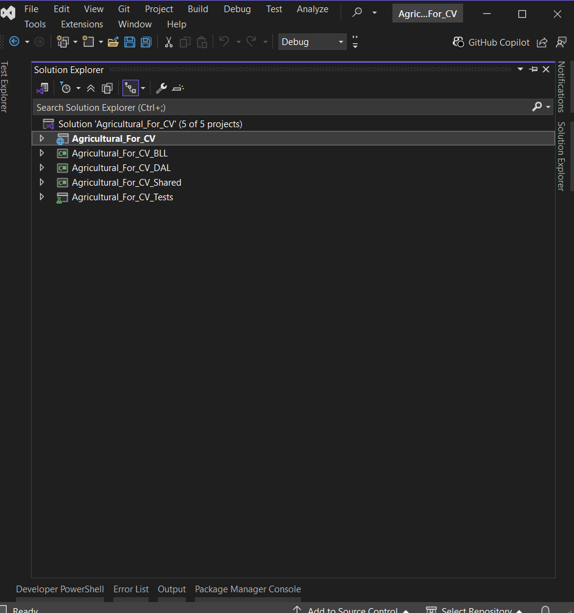
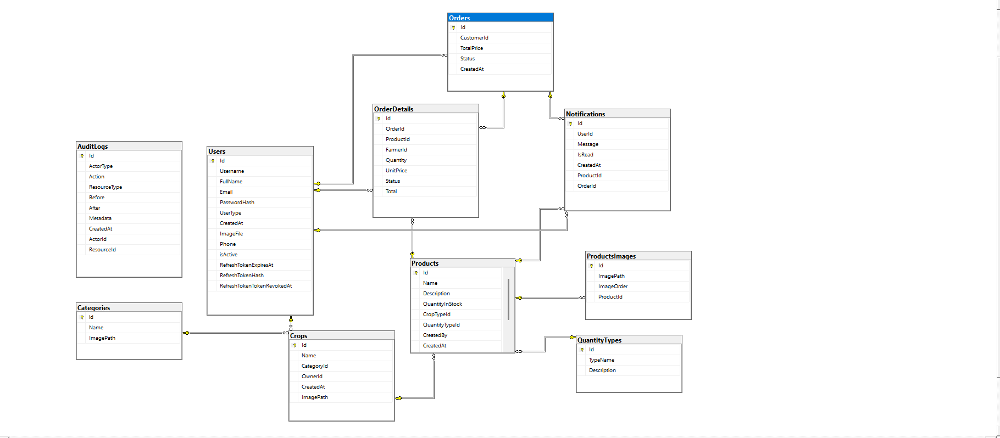

# 🌾 Agricultural Platform - Backend API

[](https://dotnet.microsoft.com/en-us/)
[](#-architectural-overview)

An enterprise-grade, high-performance backend system designed to bridge the gap between farmers and customers. This platform manages complex agricultural workflows, including crop management, product listing, order processing, and notifications.

---

## 🏗 Architectural Overview

The project is built using **Layered Architecture** principles to ensure strict separation of concerns, high testability, and scalability.


- **API Layer:** Handles HTTP requests, middlewares (Error Handling, Profiling, JWT), and API Versioning.
- **BLL (Business Logic Layer):** Core service logic, DTO mapping, Result Pattern, and business rules.
- **DAL (Data Access):** A specialized layer using a **Hybrid ORM** approach:
    - **EF Core 9:** For complex relationships and Unit of Work.
    - **Dapper:** For raw SQL performance in analytical reporting. - **SQL Server** - **Repository Pattern**
- **Shared:** Holds cross-cutting concerns, DTOs, and the **Result Pattern**.
- **Unit Testing**:

---

## 📸 Visual Overview




---

## 🚀 Key Technical Features

### 1. Security & Identity

- **JWT Authentication** with strict validation (`ClockSkew = TimeSpan.Zero`).
- **Custom Authorization Policies** (e.g., `CustomerOwnerOrAdmin`).
- **Audit Logging** for tracking critical actions.

### 2. Performance & Reliability

- **Rate Limiting:** Sliding Window (users) + Fixed Window (auth).
- **Global Error Handling:** Unified JSON responses.
- **Profiling Middleware:** Track request execution time.

### 3. Database Experience

- **Entity Framework:** for CRUDS Operations
- **Dapper:** for Reports and heavy queries with stored procuders

### 4. Developer Experience (DX)

- **Custom Dark Swagger UI**
- **API Versioning**

### 5. Monitoring

- **Audit:** `IAuditLogService` To take snapshot for every operation in system

```bash
public async Task LogAsync(AuditLogDto dto)
{
    var log = new AuditLogs
    {
        ActorId = dto.ActorId,
        ActorType = dto.ActorType,
        Action = dto.action,
        ResourceType = dto.ResourceType,
        ResourceId = dto.ResourceId,
        Before = dto.Before != null ? JsonSerializer.Serialize(dto.Before) : null,
        After = dto.After != null ? JsonSerializer.Serialize(dto.After) : null,
        Metadata = dto.Metadata != null ? JsonSerializer.Serialize(dto.Metadata) : null,
        CreatedAt = DateTimeOffset.UtcNow
    };

    await _repo.AddAsync(log);
}
```

- **Image Cleanup Service : ** To clean up the images that marked is deleted in background.
  `public class ImageCleanupService : BackgroundService`
- ** Logging System:** Every step in the system is logged.

---

## 🛠 Tech Stack

- **Backend:** ASP.NET Core 8 (Web API)
- **Database:** SQL Server
- **ORM:** Entity Framework Core and Dapper
- **Testing:** xUnit & Moq
- **Documentation:** Swagger / OpenAPI

---

## ⚙️ Setup & Installation

### Prerequisites

```bash
- [.NET 8 SDK](https://dotnet.microsoft.com/download/dotnet/8.0)
- [SQL Server](https://www.microsoft.com/en-us/sql-server/sql-server-downloads)
```

---

## 🔧 Configuration

Update `appsettings.json`:

```json
{
  "ConnectionStrings": {
    "DefaultConnection": "Server=.;Database=AgriculturalDB_For_CV;User Id=sa;Password=YOUR_PASSWORD;TrustServerCertificate=True;"
  },
  "AppSettings": {
    "SecretKey": "YOUR_SECRET_KEY",
    "Issuer": "AgriculturalApp",
    "Audience": "AgriculturalUsers"
  }
}
```

## 📦 Database Migration

````bash
dotnet ef database update --project Agricultural_For_CV_DAL --startup-project Agricultural_For_CV

## 🚀 Running the Application
```bash
dotnet run --project Agricultural_For_CV

## 🧪 Testing
```bash
dotnet test
````

## 👨‍💻 Author

**Hasan Ameen Alfahd** **IT Specialist & Full-Stack Developer**.

[](https://linkedin.com/in/hassan-alfahd)
[](https://github.com/Hassanalfhd)

```

```
